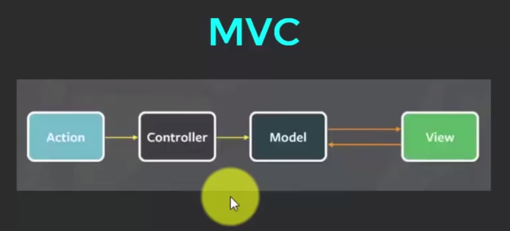
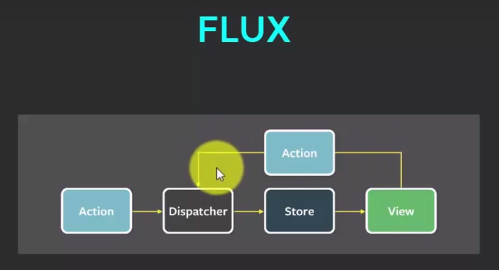

### MVC

                                 

* 어떤 Action이 입력되면 Controller는 그걸 받아서 Model이 지니고 있는 데이터를 조회하거나 업데이트 할 수 있다  
그 변화는 View에 반영된다. 또한 뷰에서 모델데이터에 접근하여 업데이트 할 수 있는 상호연관 구조를 가진 아키텍쳐 모델이다.

* 하지만 app의 규모가 커지면 model과 view의 갯수가 많아지면 무한반복에 빠질 가능성이 크다.

* 그래서 개발된 것이 아래 그림의 FLUX 아키텍쳐

### FLUX

* 시스템에서 어떤 action을 받았을 때 dispatcher가 받은 action을 통제하여   store에 있는 데이터를 업데이트 한다.  

* 변경된 데이터가 있다면 뷰에 리렌더링 함.

* 그리고나서 뷰에서 dispatcher로 action을 보냄.

* 작업이 중첩되지않도록 해줌 어떤 action이 dispatcher를 통하여 스토어에 있는 작업을처리하고 끝나기전까지 action을 대기시킴.

* [FLUX로의 cartoon 안내서](http://bestalign.github.io/2015/10/06/cartoon-guide-to-flux/)